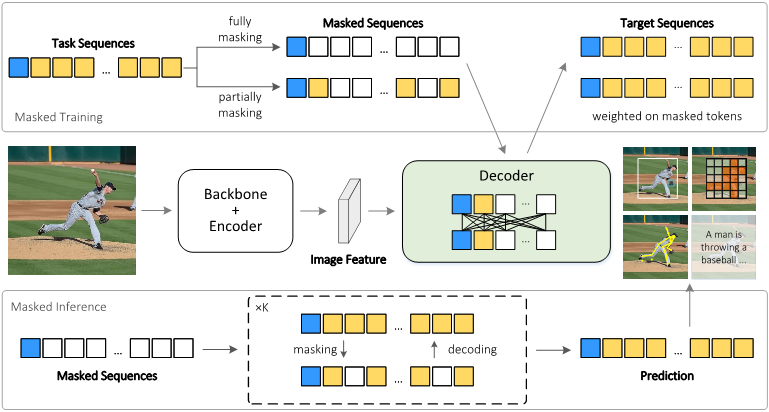

## Masked AutoDecoder
This is the official implementation of the paper "[Masked AutoDecoder is Effective Multi-Task Vision Generalist](url=https://openaccess.thecvf.com/content/CVPR2024/html/Qiu_Masked_AutoDecoder_is_Effective_Multi-Task_Vision_Generalist_CVPR_2024_paper.html)" 

Authors: Han Qiu, Jiaxing Huang, Peng Gao, Lewei Lu, Xiaoqin Zhang, Shijian Lu

In this work, we design Masked AutoDecoder(MAD), an effective multi-task vision generalist. MAD consists of two core designs. First, we develop a parallel decoding framework that introduces bi-directional attention to capture contextual dependencies comprehensively and decode vision task sequences in parallel. Second, we design a masked sequence modeling approach that learns rich task contexts by masking and reconstructing task sequences. In this way, MAD handles all the tasks by a single network branch and a simple cross-entropy loss with minimal task-specific designs.

<div align="center">
  
</div><br/>

### Installation
First Install [Detectron2](https://github.com/facebookresearch/detectron2).

Then,
```bash
cd MAD
pip install -e .
```

Please refer to [Installation Instructions of Detrex](https://detrex.readthedocs.io/en/latest/tutorials/Installation.html) for details of installation.


### Data Preparation
```bash
# First prepare COCO dataset at "./datasets" as following:
- datasets
  - coco
    - annotation
      - captions_train2017.json
      - captions_val2017.json
      - instances_train2017.json
      - instances_val2017.json
      - person_keypoints_train2017.json
      - person_keypoints_val2017.json
    - train2017
    - val2017

# merge the keypoint anno and coco instance anno 
python ./project/mad/data/merge_annotations.py
```

### Training
```bash
python tools/train_net.py --num-gpus 4 --dist-url auto --config-file ./project/mad/model/config.py
```

### Evaluation
```bash
python tools/train_net.py --num-gpus 1 --dist-url auto --config-file ./project/mad/model/config.py --eval-only 
```


### Acknowledgement
We build MAD based on [detrex](https://github.com/IDEA-Research/detrex).


### Citation
If you find our work helpful please cite:
```BibTex
@InProceedings{Qiu_2024_CVPR,
    author    = {Qiu, Han and Huang, Jiaxing and Gao, Peng and Lu, Lewei and Zhang, Xiaoqin and Lu, Shijian},
    title     = {Masked AutoDecoder is Effective Multi-Task Vision Generalist},
    booktitle = {Proceedings of the IEEE/CVF Conference on Computer Vision and Pattern Recognition (CVPR)},
    month     = {June},
    year      = {2024},
    pages     = {14152-14161}
}
```


